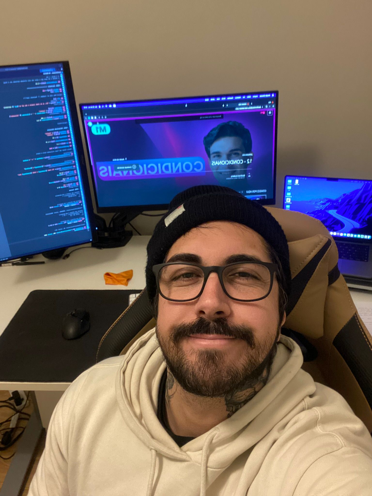

# 🚀 Leandro Rodrigues Alexandre – Learning & Projects Hub

## 🌟 About this Certificate Repository

This repository gathers some of the knowledge I've acquired throughout my learning journey — a journey that started as a personal challenge and quickly turned into a deep passion for discovering, creating, and growing.  
Learning has always been one of the most fulfilling forms of progress for me. Each course, project, or technology I've explored represents more than just a certificate — it marks another step toward mastering skills that truly inspire me.  

Here, I share not just achievements, but my ongoing commitment to the incredible process of learning. I truly believe that what keeps us motivated, passionate, and happy in what we do is the opportunity to learn something new every day.  
And this is just the beginning — I continue to study, experiment, and expand my horizons. Because learning is infinite, and within it lies true growth.

---

## 🌐 Technologies & Courses

### Backend
Learning backend is crucial to build robust, secure, and scalable applications. My courses and projects include:

- **Node.js & Express** – Creating REST APIs, managing databases, and integrating with frontend.  
  **Installation:** `npm install node express`  
  **Basic usage:** Create a server with `express()` and define API routes.
  
- **.NET (C#)** – Backend development with ASP.NET Core and RESTful APIs.  
  **Installation:** [Download .NET SDK](https://dotnet.microsoft.com/en-us/download)  
  **Basic usage:** `dotnet new webapi` to start a new project.

- **Java & Spring Boot** – Enterprise applications and REST APIs.  
  **Installation:** [JDK + Spring Boot CLI](https://spring.io/projects/spring-boot)  
  **Basic usage:** `spring init --dependencies=web myproject`

- **Databases**  
  - **PostgreSQL** – Robust and scalable relational database.  
  - **MongoDB & Mongoose** – NoSQL database for flexible data.  
  **Installation:** [PostgreSQL](https://www.postgresql.org/download/), [MongoDB](https://www.mongodb.com/try/download/community)

- **Authentication & Security**  
  - JWT Authentication, access control, and security best practices.

- **Advanced Practices**  
  - DDD (Domain Driven Design)  
  - Clean, Hexagonal, and MVC Architectures  
  - Automated testing (unit and integration testing)

---

### Frontend
Essential for creating modern and responsive user interfaces:

- **React.js & Next.js** – SPA and SSR.  
  **Installation:** `npx create-next-app@latest`  
  **Basic usage:** Create pages with functional components.

- **Angular** – Structured web applications with TypeScript.  
  **Installation:** `npm install -g @angular/cli`  
  **Basic usage:** `ng new my-app`

- **State Management** – Managing state in complex applications (Redux, Context API).

- **HTML, CSS & Tailwind** – Foundations of modern frontend and fast styling.

---

### Fullstack
Complete integration between frontend, backend, and database:

- Projects like **HireFast**, **Jurne**, and other E-commerce & CRUD apps.
- End-to-end applications with production deployment.
- Agile methodologies (Scrum, Kanban).

---

### Mobile
Developing native applications:

- **Swift & SwiftUI** – Modern iOS apps with declarative UI.  
  **Installation:** [Xcode](https://developer.apple.com/xcode/)  
  **Basic usage:** Create Views with SwiftUI and integrate APIs.

- **Libraries & Extensions** – Combine, Alamofire, Kingfisher, etc., for advanced functionality.

---

### DevOps & Tools
Automation, deployment, and productivity:

- **Docker & Terraform** – Containerization and infrastructure as code.  
- **n8n** – Workflow automation.  
- **Git & GitHub** – Version control and collaboration.  
- **VSCode, Visual Studio, Xcode** – IDEs for different stacks.

---

### Productivity & Learning
Learning how to learn is essential for any developer:

- **PARA Method & Study Guides** – Organize studies and projects.  
- **How to Take Smart Notes** – Efficient note-taking and retention.  
- **Pragmatic Programmer & Clean Agile** – Development best practices.

---

## 📂 Learning Structure
I organize courses and projects into categories:

- **Backend:** API, Node.js, .NET, Java  
- **Frontend:** React, Next, Angular  
- **Fullstack:** End-to-end projects  
- **Mobile:** Swift, SwiftUI, iOS apps  
- **Database:** PostgreSQL, MongoDB  
- **DevOps & Tools:** Docker, Terraform, n8n, Git  
- **Security:** Authentication, JWT  
- **Architecture:** DDD, Clean, Hexagonal, MVC  
- **Fundamentals:** Programming basics, control structures  
- **Productivity:** Organization, learning methods  
- **Testing:** Unit, integration, automation  

---

## 💡 Conclusion
Each technology studied has its own role and importance:  
- Backend ensures application logic and security.  
- Frontend provides user experience and interactivity.  
- Mobile extends usability and accessibility.  
- DevOps and Tools make the development cycle efficient.  
- Productivity & Learning accelerate personal and professional growth.  

> The goal is to combine theoretical knowledge with real-world practice, applying every tool and framework in concrete, scalable projects.

---

## 🔗 Contact & Projects
- GitHub: [https://github.com/softwareLeandro](https://github.com/softwareLeandro)  
- Dev.to: [https://dev.to/cuscodev](https://dev.to/cuscodev)  
- LinkedIn: [Leandro R. Alexandre](https://www.linkedin.com/in/leandro-r-alexandre/)

